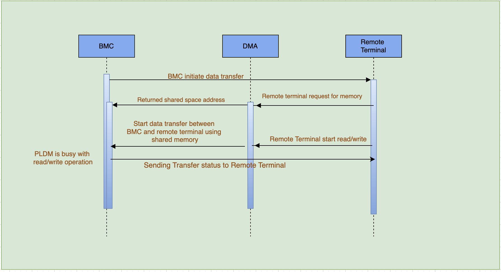
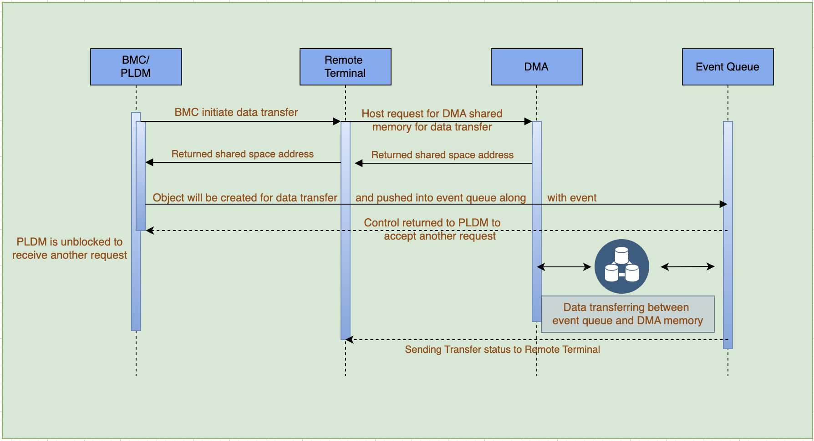
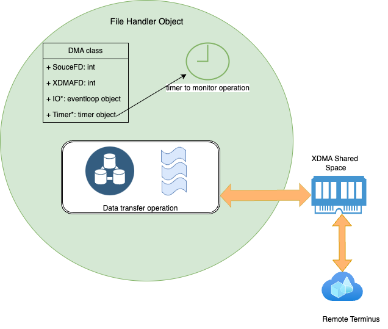

# Asynchronous file transfer
    
    
#### Problem:

    PLDM is a supporting platform-level data models and platform functions in a platform management subsystem. PLDM is designed
    to be an effective interface and data model that provides efficient access to low-level platform inventory, monitoring, control,
    event, and data/parameters transfer functions.
    Currently, PLDM transferring data between 'Remote terminus' and PLDM which could be any size over socket communication and it's transfer 
    synchronous manner, so whenever one end of the socket has problem then PLDM is always wait to finish read/write operation and 
    the reason of interrupting data transfer could be anything like socket problem, slow network connection, 'Remote terminus' goes down abruptly, etc.

#### Current Scenario:

BMC transfer all the data using PLDM. PLDM is transferring small chunk data (4KB) over LPC channel and if big chunk data which is transferred over DMA shared memory. DMA basically stands for Direct Memory Access and it is a XDMA drivers which enables data transfer between the Memory and the IO (Input/ Output) device.    

Above image sequence diagram which demonstrate that BMC start initiating data transfer between BMC and 'Remote terminus' via PLDM protocol and 
there are many files which are transferred over this channel like PELs, Certificates, Dumps, Lids etc ...
Onces file transfer completed then PLDM is free to accept the other incoming PLDM requests from other clients, but during file
transfer there are many reasons which can be affect the file transfer operation such as slow network connection, socket port closing,
network traffic etc.. and because of various reason read/write call could be blocked which blocks the PLDM eventually and PLDM is 
not able to receives incoming request and it's blocks the BMC communication, however some workaround like PLDM daemon restart can be 
fixed this issue but at customer site there are no possibility to resolve this issue.

#### Asynchronous file transfer using Event loop:

Event loop is known as message dispatcher or message loop or run loop and it's a design pattern that waits for dispatches events or messages in a program. Event loop maintains the message queue internally which maintains the each operations objects and executes that operation, once operation is done then it's remove object from message queue and it's executes each operation without blocking the main thread.

Above image sequence diagram which demonstrate that when BMC receives the request for file transfer between BMC and 'Remote terminus' via PLDM protocol then PLDM will create file object and inside this file object PLDM creates three object (DMA class object, sdbusplus evenloop object, Timer object) which are handling the file transfer operation independently.this four objects will be not deleted because DMA object and eventloop object has cyclic dependency and to monitor the whole operation, one Timer object is also created inside DMA object which delete all objects incase of Time-out condition. Once all object creation completed then control goes to PLDM main thread and DMA and eventloop objects are co-existed to perform transfer operation then event loop picks this operation from the event queue and requests to XDMA driver for shared memory location then it's request 'remote terminus' to start read/write operation of file and at the end of file transfer PLDM will send the transfer operation status(SUCCESS/ERROR) to 'remote terminus'.
When the transfer operation is completed then it's executes the callback function which is designed to perform post transfer ooperation for perticular file type and after that cyclic dependency will be removed and all four objects(File object,DMA object, Evenloop object, Timer object) will be destroy and freed the memory.

What does file object contain?

The file object contains the two class object 1.DMA class 2.sdbusplus eventloop(IO) class.
The eventloop class object is created to push each file operation into event queue and once it's completed then it's object will be deleted using unique pointer.

The DMA class is responsible as below:
1. Handling the file descriptor for shared memory 
2. Source file descriptor where data is read/write
3. Timer object to monitor the operation and delete each object incase of timeout
4. Delete cyclic dependency between DMA class object and eventloop class object
5. callback pointer to execute operation after file transfer completes.

How Does Object created for file transfer?

you can visualize objects as per below image:

